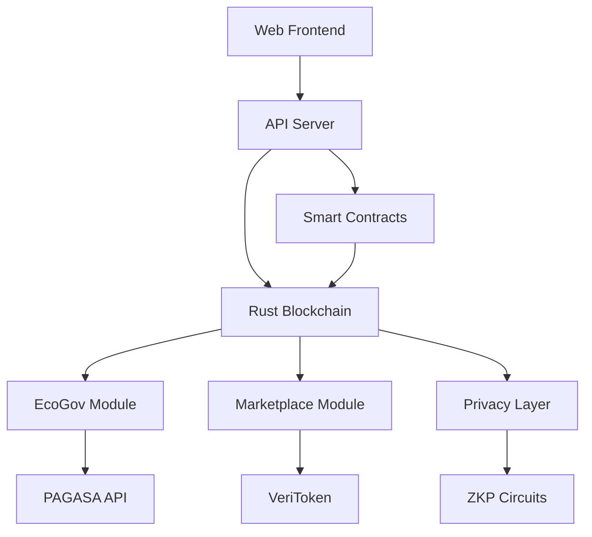

# 🌟 LightChain BlockChain - Complete Ecosystem


> **A comprehensive blockchain ecosystem for environmental governance, digital marketplace, and decentralized applications.**

## 🚀 **What is LightChain?**

LightChain is a complete blockchain ecosystem that combines:
- **🌍 Environmental Governance** (EcoGov) with climate monitoring
- **🛒 Digital Marketplace** with authentic product verification  
- **💰 DeFi Features** with VeriToken economics
- **🔒 Privacy & Security** with zero-knowledge proofs
- **📱 Web3 Integration** with MetaMask support

---

## 📁 **Repository Structure (Monorepo)**

```
LightChain-BlockChain/
├── 🦀 blockchain/              # Core Rust blockchain implementation
│   ├── src/                   # Rust source code
│   ├── Cargo.toml            # Rust dependencies
│   └── README.md             # Blockchain documentation
│
├── 📜 smart-contracts/        # Solidity smart contracts
│   ├── contracts/            # Contract source files
│   ├── scripts/              # Deployment scripts
│   ├── hardhat.config.js     # Hardhat configuration
│   └── README.md             # Contracts documentation
│
├── 🌐 web-frontend/           # React/Web3 frontend
│   ├── src/                  # Frontend source code
│   ├── public/               # Static assets
│   ├── package.json          # Node.js dependencies
│   └── README.md             # Frontend documentation
│
├── 🔧 api-server/             # Express.js API backend
│   ├── routes/               # API routes
│   ├── middleware/           # Express middleware
│   ├── package.json          # Server dependencies
│   └── README.md             # API documentation
│
├── 🌍 ecogov-system/          # Environmental governance module
│   ├── bantay-panahon/       # Weather monitoring (PAGASA integration)
│   ├── climate-data/         # Climate change tracking
│   └── README.md             # EcoGov documentation
│
├── 🛒 marketplace/            # Digital marketplace module
│   ├── product-auth/         # Product authenticity verification
│   ├── veritoken/            # VeriToken implementation
│   └── README.md             # Marketplace documentation
│
├── 🔐 privacy-layer/          # Zero-knowledge proofs & privacy
│   ├── zkp-circuits/         # ZKP circuit implementations
│   ├── did-system/           # Decentralized Identity
│   └── README.md             # Privacy documentation
│
├── 🚀 deployment/             # Deployment scripts & configs
│   ├── docker/               # Docker configurations
│   ├── vercel/               # Vercel deployment
│   ├── hostinger/            # Hostinger deployment
│   └── README.md             # Deployment guide
│
├── 📖 docs/                   # Complete documentation
│   ├── technical/            # Technical specifications
│   ├── user-guides/          # User manuals
│   ├── api-reference/        # API documentation
│   └── whitepaper.md         # Project whitepaper
│
└── 🧪 examples/               # Code examples & demos
    ├── basic-usage/          # Basic implementation examples
    ├── integrations/         # Third-party integrations
    └── README.md             # Examples documentation
```

---

## ⚡ **Quick Start**

### Prerequisites
- Node.js 18+
- Rust 1.70+
- MetaMask wallet

### 1. Clone Repository
```bash
git clone https://github.com/LightChainBlockChain/LightChain-Complete.git
cd LightChain-Complete
```

### 2. Install Dependencies
```bash
# Install all project dependencies
npm run install-all

# Or install individually:
cd blockchain && cargo build
cd ../api-server && npm install
cd ../web-frontend && npm install
```

### 3. Start Development
```bash
# Start all services
npm run dev

# Or start individually:
npm run dev:blockchain    # Start Rust blockchain
npm run dev:contracts     # Deploy smart contracts  
npm run dev:api          # Start API server
npm run dev:frontend     # Start React frontend
```

### 4. Access Applications
- **Frontend**: http://localhost:3000
- **API Server**: http://localhost:8080
- **Blockchain RPC**: http://localhost:8545

---

## 🏗️ **Architecture Overview**



---

## 🌟 **Key Features**

### 🌍 **Environmental Governance (EcoGov)**
- Real-time climate monitoring via PAGASA API
- Carbon credit tracking and trading
- Environmental impact assessment
- Sustainable development goals (SDG) tracking

### 🛒 **Digital Marketplace**
- Product authenticity verification using blockchain
- VeriToken reward system for verified purchases
- Anti-counterfeiting measures
- Merchant reputation system

### 🔒 **Privacy & Security**
- Zero-knowledge proof implementations
- Decentralized Identity (DID) system
- Secure multi-party computation
- Privacy-preserving transactions

### 💰 **DeFi Features**
- VeriToken (VERI) - utility and governance token
- Staking and yield farming
- Liquidity pools
- Automated market maker (AMM)

---

## 🔧 **Technology Stack**

| Component | Technology | Purpose |
|-----------|------------|---------|
| **Blockchain** | Rust | Core blockchain implementation |
| **Smart Contracts** | Solidity | On-chain logic and tokens |
| **Frontend** | React + Web3.js | User interface |
| **Backend** | Node.js + Express | API services |
| **Database** | PostgreSQL | Off-chain data storage |
| **Privacy** | Circom + snarkjs | Zero-knowledge proofs |
| **Deployment** | Docker + Vercel | Containerization & hosting |

---

## 📚 **Documentation**

- [📘 **Technical Whitepaper**](./docs/whitepaper.md)
- [🔧 **API Reference**](./docs/api-reference/)
- [👥 **User Guide**](./docs/user-guides/)
- [🚀 **Deployment Guide**](./docs/deployment/)

---

## 🤝 **Contributing**

We welcome contributions! Please see our [Contributing Guide](./CONTRIBUTING.md).

### Development Workflow
1. Fork the repository
2. Create feature branch: `git checkout -b feature/amazing-feature`
3. Commit changes: `git commit -m 'Add amazing feature'`
4. Push to branch: `git push origin feature/amazing-feature`
5. Submit a Pull Request

---

## 📄 **License**

This project is licensed under the MIT License - see the [LICENSE](./LICENSE) file for details.

---

## 🔗 **Links & Resources**

- **Website**: [lightchain.org](https://lightchain.org)
- **Documentation**: [docs.lightchain.org](https://docs.lightchain.org)
- **Discord**: [Join our community](https://discord.gg/lightchain)
- **Twitter**: [@LightChainOrg](https://twitter.com/LightChainOrg)

---

## 👥 **Team**

- **Lead Developer**: [Your Name]
- **Blockchain Engineer**: [Team Member]
- **Frontend Developer**: [Team Member]
- **Smart Contract Auditor**: [Team Member]

---

*Built with ❤️ for a sustainable and decentralized future*
